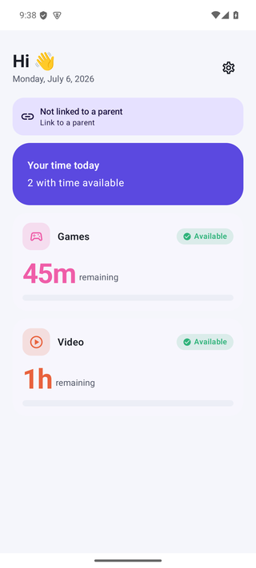
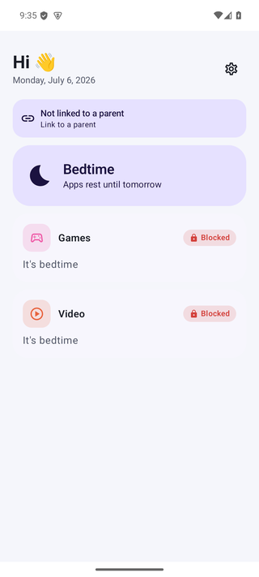
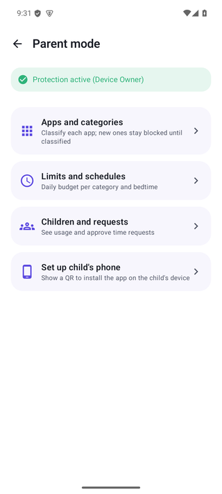
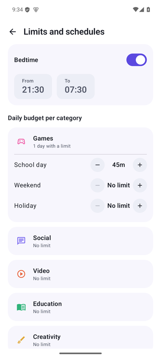
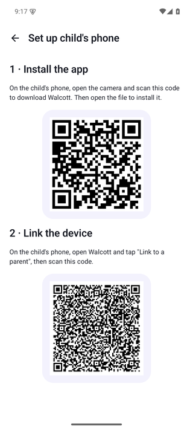

# Walcott — family parental control for Android

[](https://github.com/olemoudi/walcott/actions/workflows/ci.yml)
[](https://github.com/olemoudi/walcott/actions/workflows/ci.yml)

A parental control app built for one family, with two things that set it apart from the
commercial options:

1. **Smart, dynamic rules** — per-category budgets by day type (school / weekend / holiday),
   bedtime, extra time on request with parent approval, and earned time via rewards.
2. **Zero recurring cost, minimal setup** — no server, no accounts, no subscriptions:
   enforcement is 100% local via Device Owner, and (from Phase 2) devices sync over
   end-to-end-encrypted messages with QR pairing.

## Screenshots

<table>
  <tr>
    <td align="center"><br><sub>Child — time left</sub></td>
    <td align="center"><br><sub>Child — bedtime</sub></td>
    <td align="center"><br><sub>Parent mode</sub></td>
    <td align="center"><br><sub>Limits &amp; bedtime</sub></td>
    <td align="center"><br><sub>Set up a child phone</sub></td>
  </tr>
</table>

## Web filter (DNS)

Walcott can block specific domains at the DNS level via a local `VpnService` (no root). As
Device Owner it pins the VPN always-on so the child can't disable it; lockdown is off, so
only DNS is intercepted and normal traffic is untouched. You can also set per-app rules
("allow this domain only from this app" / "block this domain in this app").

**Limitations, by design:** DNS blocking catches plain DNS lookups. Apps that use their own
encrypted DNS (DoH/QUIC) or hard-coded IPs — notably the YouTube app and some browsers — can
bypass it; robust blocking of those needs SNI/full-tunnel inspection (not implemented).
Per-app attribution is best-effort (`getConnectionOwnerUid`); when a query can't be
attributed, "allow-only-from-app" rules fail closed. IPv4 DNS only for now.

## Language & localization

All code and comments are in English. All user-facing text is localized: English is the
default (`app/src/main/res/values/strings.xml`) and Spanish ships in
`app/src/main/res/values-es/strings.xml`. Keep both files in sync when adding strings.

## Modules

- `:core-rules` — the rule engine: pure Kotlin, deterministic, no Android dependencies.
  All budget/window/bedtime logic lives here, fully unit-tested.
- `:app` — the Android app (Compose, minSdk 29). Acts as a DPC (Device Policy Controller):
  on the child's phone it is provisioned as Device Owner.

## Install the alpha

Download the latest signed APK and sideload it:

**https://github.com/olemoudi/walcott/releases/latest/download/walcott-alpha.apk**

The parent app can also show this as a QR code (Parent mode → *Set up child's phone*) so the
child just scans it with their camera. The alpha release is signed with the debug key on
purpose — fine for personal sideloading, not for the Play Store.

## Development (WSL2)

Toolchain installed under `$HOME` (no sudo):

```bash
export JAVA_HOME=$HOME/.jdks/jdk-17.0.19+10
export ANDROID_HOME=$HOME/Android/Sdk
export PATH=$JAVA_HOME/bin:$ANDROID_HOME/platform-tools:$ANDROID_HOME/emulator:$PATH
```

Build and test:

```bash
./gradlew test               # unit tests (core-rules + app)
./gradlew :app:assembleDebug # APK in app/build/outputs/apk/debug/
```

## Provisioning a child phone as Device Owner

On a new or factory-reset phone, either:

- **QR / setup wizard**: tap the welcome screen 6 times to open the QR reader (standard MDM
  enrollment), or
- **ADB (development)**:

```bash
adb install app/build/outputs/apk/debug/app-debug.apk
adb shell dpm set-device-owner dev.walcott/.WalcottAdminReceiver
adb shell appops set dev.walcott android:get_usage_stats allow
```

If `set-device-owner` fails with "already some accounts on the device", wait a minute for a
transient sign-in to clear and retry.

## Releases

Push a tag matching `v*` and GitHub Actions builds `assembleRelease`, runs the tests, and
publishes the APK as the release asset `walcott-alpha.apk` (the stable name the in-app QR
points at):

```bash
git tag v0.1.0-alpha
git push origin v0.1.0-alpha
```
