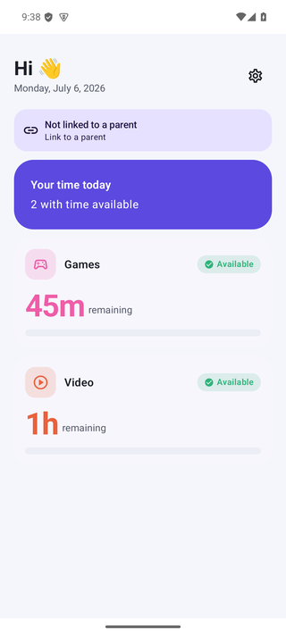
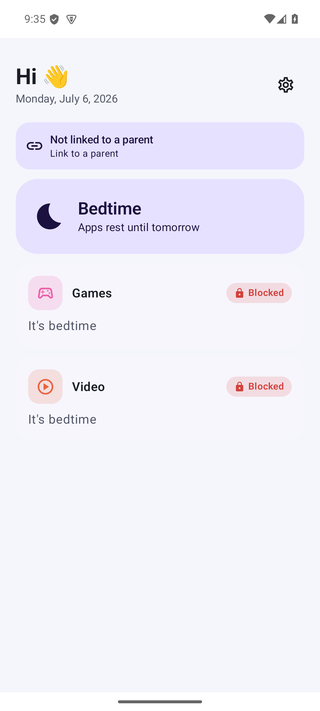
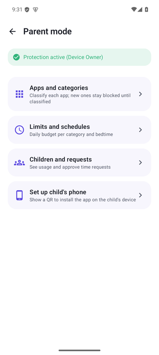
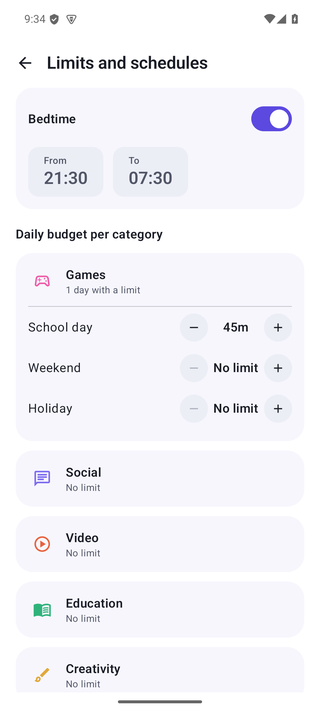
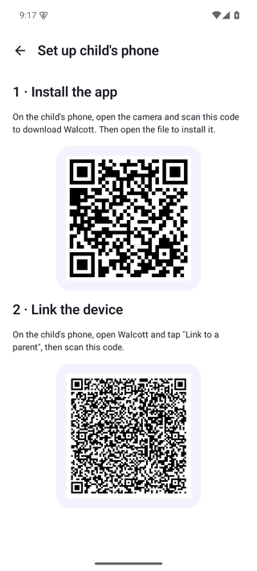

# Walcott — family parental control for Android

Screen-time rules for your kids' phones that actually hold: no accounts, no subscriptions,
no company holding your family's data. Everything runs on your own phones.

<table>
  <tr>
    <td align="center"> Child — time left</td>
    <td align="center"> Child — bedtime</td>
    <td align="center"> Parent mode</td>
    <td align="center"> Limits &amp; bedtime</td>
    <td align="center"> Set up a child phone</td>
  </tr>
</table>

## Download

Point your phone's camera at this code, or tap the link below.

**[github.com/olemoudi/walcott/releases/latest/download/walcott.apk](https://github.com/olemoudi/walcott/releases/latest/download/walcott.apk)**

The same app is both the parent app and the child app — you choose which on first launch.
Android 10 or newer. Once installed, Walcott keeps itself up to date from this same page.

Your phone will warn you that the file comes from outside the Play Store, and Play Protect
may offer to scan it first — that is normal for any app installed this way.

> **Beta software.** Walcott is used by its author's family every day and is offered as-is.
> The child's phone has to be set up from scratch, so try it on a phone you can afford to
> factory-reset.

## What it does

**Time limits that understand the week.** Apps are grouped into categories (games, video,
social…), and each category gets its own daily budget per kind of day: school days, weekends,
and special days. Bedtime is per kind of day too.

**Special days.** Mark a holiday, a school break, or a birthday, and the rules for that day
change automatically. A special day can apply to the whole family or to one child only — a
birthday belongs to whoever's it is.

**Screen-free windows.** Block every app during homework, dinner or class, family-wide or per
app, on the days you choose.

**Asking for more.** The child can request extra time from their phone; you get a
notification and approve or deny with one tap. You can also hand out bonus time unprompted.

**Earned time.** Optionally, time spent off the phone during set hours converts into extra
screen time — putting it down is worth something.

**Per-app rules.** Any single app can have its own budget and its own blocked hours, on top of
its category's.

**Web filtering.** Block specific domains without root, using a local VPN that only inspects
DNS. You can see what a child's app is actually contacting and block it from there.

**Where they are.** Optional location, with a recent trail on your map.

**Emergency button.** A way out that doesn't depend on you being reachable — see below.

The app is fully usable in **English** and **Spanish**, following your phone's language.

## Setting it up

**On your phone (the parent):** install, open, choose *Parent mode*, set a PIN. Create a
child, and Walcott shows you a QR code to pair with.

**On the child's phone:** Walcott has to be installed on a **new or factory-reset phone** —
that is what lets it hold rules the child can't simply switch off. During the initial Android
setup wizard, tap the welcome screen six times to open the QR reader, and scan the enrollment
code. Then open Walcott, scan the pairing QR from your phone, and you're done.

Rules you change on your phone reach theirs within seconds.

**Worth knowing before you start:**

- The child's phone must be set up from scratch. There's no way to convert a phone already in
  use without wiping it.
- Walcott is **not compatible with Google Family Link** on the same device — pick one.
- Set up a backup (Parent mode → settings) as soon as you have rules worth keeping. It is how
  you recover if your phone is lost or replaced.

## No accounts, no servers of ours

There is no Walcott account and no Walcott server. Your phones talk to each other through a
public notification relay, and everything they say is **encrypted end-to-end** with a key
created when you pair — the relay carries sealed envelopes it cannot read, and rule changes
are signed so only your parent phone can issue them.

Nothing about your family reaches us, because there is no "us" to reach: no analytics, no
crash reporting, no ads, no telemetry of any kind.

## When the rules can't be trusted, they tighten

Two things the rules depend on can be taken away on the child's phone, and both are answered
the same way — by blocking managed apps until they come back, so tampering costs time instead
of buying it:

- **Usage access**, without which budgets never count down.
- **The clock.** Every rule is a rule about *when*, so a clock moved forward would walk past
  bedtime and hand back a fresh day. Walcott measures the phone's clock against the relay's
  timestamps instead of trusting it, and past 15 minutes of drift the rules fail closed. The
  child's home screen says so and points at the setting; with automatic time on it fixes
  itself as soon as there's a network.

A family with no budgets, windows or bedtime can't be cheated this way, so neither rule locks
anything on a phone nobody was limiting.

## Getting a phone back

Walcott is deliberately hard to remove, which raises a fair question: what if the parent's
phone dies and the backup is gone with it? There are two ways out, both from the child's
phone:

- **With the parent PIN** — settings → *Remove Walcott from this device*. Unblocks every app,
  gives back every setting, erases the rules and history and drops out of management. Nothing
  is left to suggest the phone was ever enrolled.
- **Without the PIN** — the child can request the same release from their home screen, and it
  takes 24 hours of being *loud*: parents are notified immediately and again every two hours,
  each alert carrying a one-tap refusal. The phone must keep reaching the family channel the
  whole time, and the countdown runs on the relay's clock, so moving the phone's clock does
  nothing. A refusal ends the request and blocks new ones for three days.

That second route is a deliberate trade-off: a determined child can free their phone in a day,
but only by telling their parents a dozen times first — and a factory reset, which Walcott
does not block, was always the faster way out anyway.

## Honest limitations

- **Web filtering is DNS-based.** It catches ordinary domain lookups. Apps that ship their own
  encrypted DNS or hard-coded addresses — notably YouTube and some browsers — can get around
  it. Blocking those properly needs full traffic inspection, which Walcott does not do.
- Per-app attribution of a domain lookup is best-effort; when a lookup can't be attributed,
  "only from this app" rules block rather than allow.
- IPv4 DNS only, for now.
- Walcott counts foreground app time. It is not a keylogger, a message reader or a screen
  recorder, and it is not intended to become one.

Source is public so anyone can check these claims for themselves.
